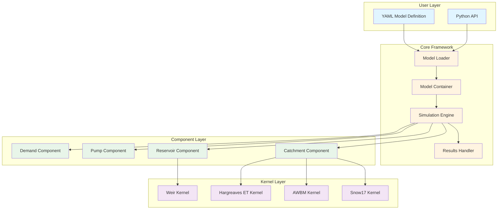
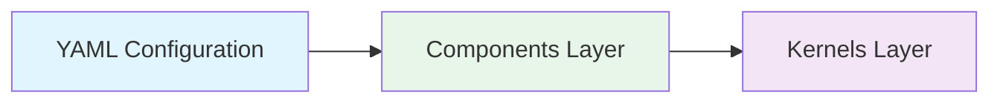
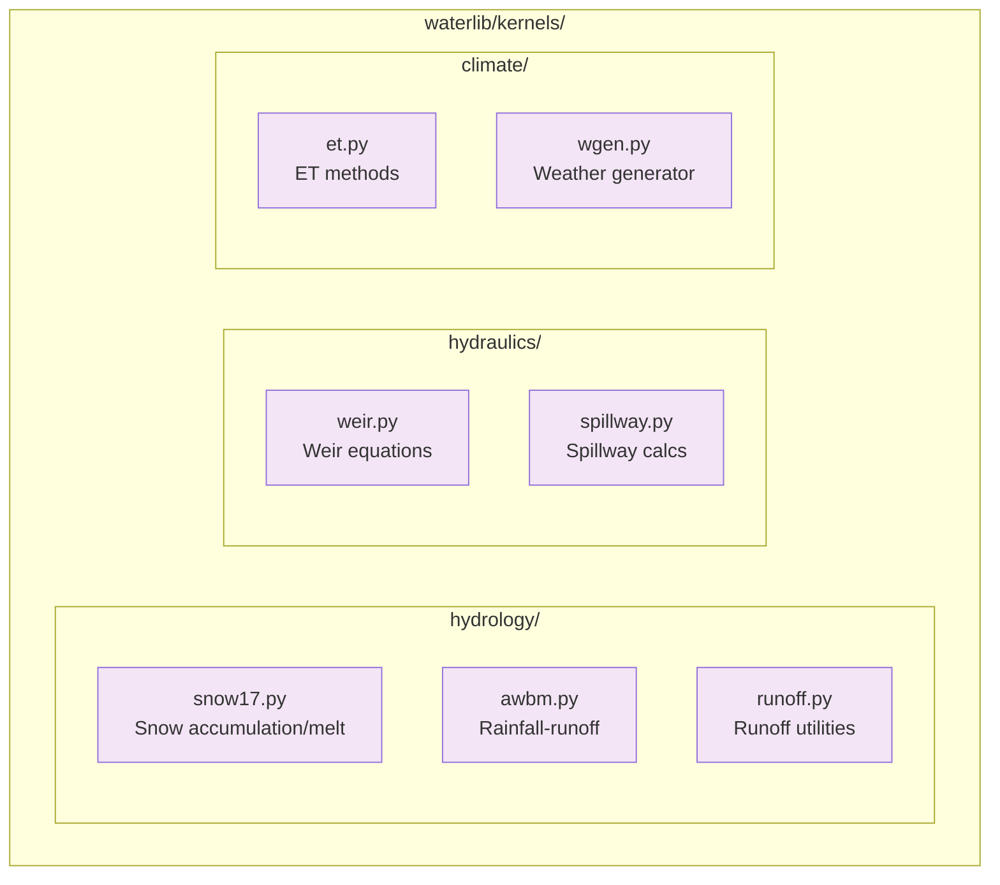

# Waterlib Architecture Diagrams

Visual overview of waterlib architecture.

---

## System Architecture Overview

---

## Dependency Flow

**Key Principle:** Dependencies flow one direction. Kernels never import components.

---

## Kernel Organization

---

## Component-Kernel Relationship

```mermaid
graph TB
    subgraph "Catchment Component"
        CatchInit[Initialize<br/>- Create kernel params<br/>- Initialize kernel states]
        CatchStep[step&#40;&#41;<br/>- Get inputs<br/>- Call Snow17 kernel<br/>- Call AWBM kernel<br/>- Package outputs]
    end

    subgraph "Snow17 Kernel"
        Snow17Func[snow17_step&#40;&#41;<br/>Pure function<br/>inputs → outputs]
    end

    subgraph "AWBM Kernel"
        AWBMFunc[awbm_step&#40;&#41;<br/>Pure function<br/>inputs → outputs]
    end

    CatchInit -.creates.-> Snow17Params[Snow17Params]
    CatchInit -.creates.-> AWBMParams[AWBMParams]
    CatchStep --> Snow17Func
    CatchStep --> AWBMFunc
    Snow17Func -.uses.-> Snow17Params
    AWBMFunc -.uses.-> AWBMParams

    style CatchInit fill:#e8f5e9
    style CatchStep fill:#e8f5e9
    style Snow17Func fill:#f3e5f5
    style AWBMFunc fill:#f3e5f5
    style Snow17Params fill:#fff4e1
    style AWBMParams fill:#fff4e1
```

---

## Kernel Function Pattern

```mermaid
graph LR
    Inputs[Inputs<br/>dataclass] --> Kernel[kernel_step&#40;&#41;<br/>Pure Function]
    Params[Params<br/>dataclass] --> Kernel
    StateIn[State<br/>dataclass] --> Kernel
    Kernel --> StateOut[New State<br/>dataclass]
    Kernel --> Outputs[Outputs<br/>dataclass]

    style Inputs fill:#e1f5ff
    style Params fill:#fff4e1
    style StateIn fill:#ffe1e1
    style Kernel fill:#f3e5f5
    style StateOut fill:#ffe1e1
    style Outputs fill:#e1f5ff
```

All kernel functions are pure (no side effects), with explicit inputs/outputs and deterministic behavior.

---

## Legend

- 🔵 **Blue**: User-facing (YAML, inputs/outputs)
- 🟡 **Yellow**: Core framework (loader, model, simulation)
- 🟢 **Green**: Components (graph nodes)
- 🟣 **Purple**: Kernels (pure algorithms)
- 🔴 **Red**: State (mutable state objects)
